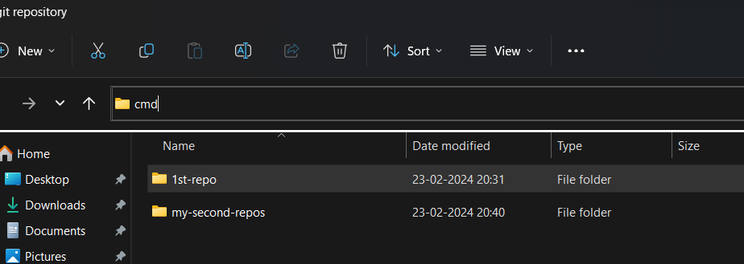

## how to take a SS in windows?
- ` win + shift + S`

## how to create a git repository?
- ` go to github 
- click on ur profile icon
- click on repos
- click on new green icon
- give a repos name
- click on add read me file
- click on create repos

## how to clone repos?
- go to git hub
- go to particular repos whcih u wanna clone
- click on  green code
- copy the URL
- open the file explorer 
- open the folder where u want to clone the repo
- type ` cmd ` in the adress bar 
    - 
-  ` git clone ` paste the url

